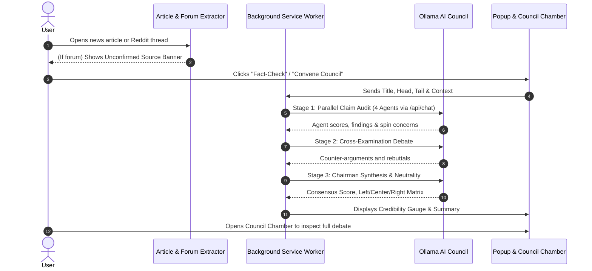

# 🏛️ Fact-Checker AI Council (Ollama Cloud Edition)

A cross-browser extension for **Mozilla Firefox / Zen Browser** and **Chromium-based browsers** (Chrome, Brave, Edge) that detects misinformation, debunks fake news, and balances political reporting using a **Council of 5 AI Agents** powered by **Ollama Cloud & Local Models** (Llama 3.2, Llama 3.1, DeepSeek R1, Mistral, Qwen 2.5).

---

## 🌟 Key Features

1. **🏛️ Multi-Agent AI Council (5 Personas)**:
   - **Dr. Veritas** (Forensic Fact & Claim Verifier) — Extracts concrete dates, statistics, and verifiable claims.
   - **Auditor Vance** (Rhetoric & Spin Auditor) — Scrutinizes headline clickbait, emotional framing, and selective omissions.
   - **Prof. Spectrum** (Political Spectrum & Bias Inspector) — Maps perspectives across **Left**, **Center**, and **Right** leaning outlets to ensure balanced neutrality.
   - **Inspector Sentinel** (Provenance & Forum Skeptic) — Flags rumors, unconfirmed sources, and social media posts.
   - **Chairman Aristotle** (Consensus Arbitrator) — Arbitrates the debate, computes consensus credibility (0–100%), and publishes the official verdict.

2. **🦙 Ollama Cloud & Local Support**:
   - Zero-configuration local connection: Works out of the box with `http://localhost:11434`.
   - Hosted & Cloud Ollama instances: Full support for custom HTTPS endpoints with optional Bearer token authorization.
   - Dynamic model discovery: Query `/api/tags` to list installed models directly in Settings.
   - Intelligent model fallback: Seamlessly falls back across available installed models (`llama3.2`, `llama3.1`, `deepseek-r1`, `mistral`, `qwen2.5`).

3. **📄 Targeted Article Extraction**:
   - Accurately captures the **Title**, **Head** (lead paragraphs), **Tail** (concluding summary), and condensed **Context** while automatically filtering out ads, navbars, and cookie banners to conserve tokens and reduce inference latency.

4. **⚠️ Reddit & Forum Monitoring**:
   - Automatically recognizes **Reddit** (`r/subreddit`, posts, comments), **Twitter/X**, **Hacker News**, and discussion forums.
   - Injects a prominent warning banner reminding users that forum posts represent unverified user-generated content.

5. **⚖️ Neutral Political Framing Matrix**:
   - Breaks down every story into **Left-Leaning Framing**, **Objective Center Grounding**, and **Right-Leaning Framing** so you can see past partisan spin.

6. **⚡ Private, Fast & Cost-Free**:
   - Zero third-party tracking; models run either on your own Ollama server or your private cloud instance.
   - Local hash caching in `chrome.storage.local` ensures re-visiting pages requires no duplicate inference.

---

## 🚀 Quick Installation Guide

### For Chromium Browsers (Google Chrome, Brave, Edge, Opera)
1. Open your browser and navigate to:
   - Chrome / Brave: `chrome://extensions`
   - Edge: `edge://extensions`
2. Toggle on **"Developer mode"** in the top-right corner.
3. Click **"Load unpacked"**.
4. Select the project directory (`Fact-Checker`).
5. Pin the 🏛️ **Fact-Checker** icon to your toolbar.

### For Mozilla Firefox & Zen Browser
1. Open Firefox/Zen and navigate to: `about:debugging#/runtime/this-firefox`
2. Click **"Load Temporary Add-on..."**.
3. Select the `manifest.json` file inside the project directory (`Fact-Checker/manifest.json`).
4. The extension is now active!

---

## 🦙 Configuring Ollama

### Local Ollama
1. Ensure Ollama is running on your machine:
   ```bash
   ollama serve
   ```
2. Pull a recommended model:
   ```bash
   ollama pull llama3.2
   ```
3. In the Fact-Checker extension popup or settings, leave the default endpoint (`http://localhost:11434`), select **Llama 3.2**, and click **Test & Connect**.

### Ollama Cloud / Remote Instance
1. In the Fact-Checker popup or Options page:
   - Enter your remote or cloud endpoint URL (e.g., `https://my-ollama.example.com`).
   - Enter your API Token / Bearer Key (if your endpoint requires authentication).
   - Click **Test & Connect** to verify connectivity and fetch installed models.

---

## 🖥️ How It Works



---

## 📁 Project Structure

```
Fact-Checker/
├── manifest.json                  # Universal Manifest V3 (Chrome, Firefox & Zen)
├── .gitignore                     # Ignores idea.md, cache, and virtual environments
├── icons/                         # Extension icons (16px, 32px, 48px, 128px)
├── src/
│   ├── background/
│   │   └── service_worker.js      # Background coordination, caching & context menus
│   ├── content/
│   │   ├── article_extractor.js   # Title, Head, Tail & Context extraction
│   │   ├── forum_detector.js      # Reddit / social forum detection & warning banner
│   │   ├── overlay.js             # In-page floating pill & quick drawer
│   │   └── overlay.css            # Isolated styling for floating UI
│   ├── core/
│   │   ├── types.js               # Council personas, score tiers & data schemas
│   │   ├── ollama_client.js       # Ollama Cloud & local client with resilient fallbacks
│   │   ├── council_debate.js      # 3-Stage debate engine & consensus synthesizer
│   │   └── bias_analyzer.js       # Left / Center / Right framing analyzer
│   ├── popup/
│   │   ├── popup.html             # Popup layout (Onboarding, Ready, Gauge, Report)
│   │   ├── popup.css              # Dark theme popup styling
│   │   └── popup.js               # Popup interactions & live progress
│   ├── council/
│   │   ├── council.html           # Full-screen Council Chamber view
│   │   ├── council.css            # Podiums, debate transcript & neutrality matrix
│   │   └── council.js             # Chamber debate player & markdown export
│   └── options/
│       ├── options.html           # Settings (Ollama endpoint, API key, model selection)
│       ├── options.css            # Settings styling
│       └── options.js             # Settings persistence & model discovery
└── tests/
    ├── test_extraction.html       # Visual fixture to test extraction & Reddit alerts
    ├── test_council.js            # Automated unit tests for council logic
    ├── test_code_integrity.py     # Code integrity and OllamaClient tests
    └── verify_extension.py        # Integrity verification script
```

---

## 🧪 Testing

To run the automated integrity and manifest checks:
```bash
python3 tests/verify_extension.py
python3 tests/test_code_integrity.py
```

To test article extraction and simulated Reddit alerts in a browser:
Open `tests/test_extraction.html` directly in Firefox or Chrome.
